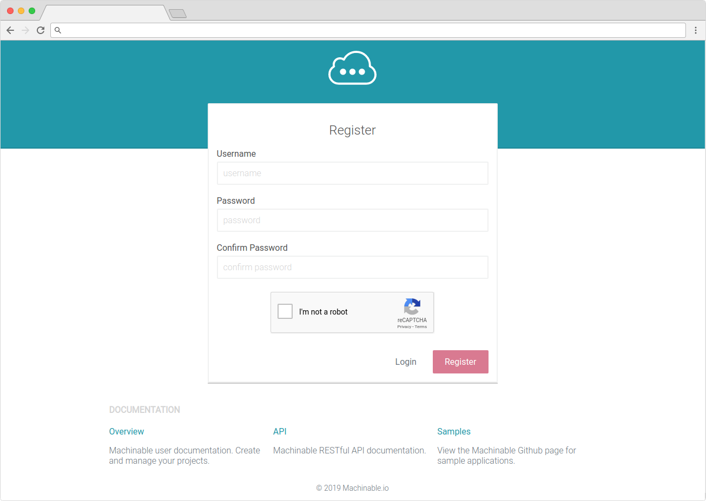
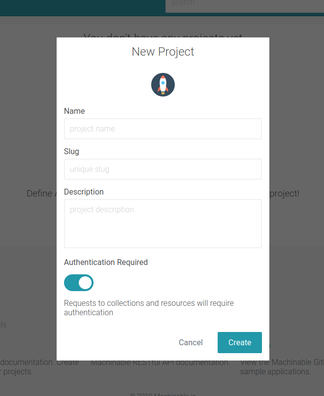

## Register

Navigate to [https://machinable.io](https://machinable.io) and register for an account. This will require a valid email address.

### 

Confirm your email by following the link in your inbox. You will then be able to login to Machinable and start managing your projects!

## Create A Project

After logging in for the first time you will see a fairly empty screen which invites you to create a new project. Click the 'Create A Project' button to get started.

### 

Provide the necessary information for your project:

**Project Icon**

Select from multiple icons. This can help identify your project in the list.

**Name**

The short, but descriptive, name of your project.

**Slug**

This is the subdomain that will be given to your project in the form of `https://{project_slug}.machinable.io`.

**Description**

A longer description of your project. What are you using this project for? Are there any relevant links that this project should reference? Etc.

**Authentication Required**

This specifies if User/API Key authentication will be required to access the API Resource and Collection data stored for this project. If this is disabled, anyone with your project links can access the data. _This can be changed at any time_.

Once you have filled out the form, click 'Create'. Your project is now ready to use!

## What's Next?

1. [Create an API Resource](/projects/resources/)
2. [Manage Collections](/projects/collections/)
3. [Create and query some data](/querying_data/crud/)
4. [Create an application that uses your Machinable project](/reference/sample_projects/)

 