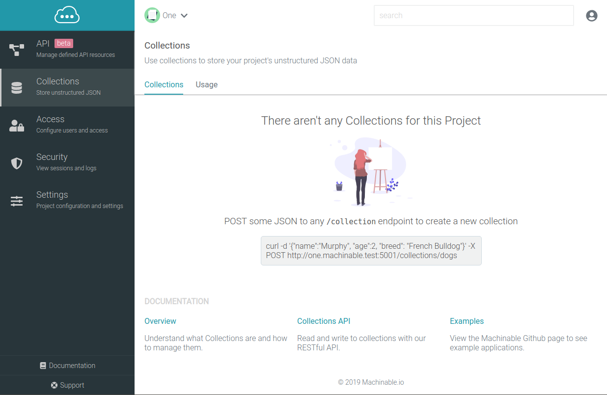
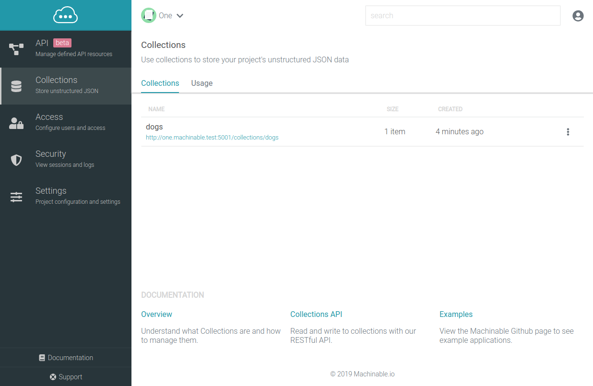
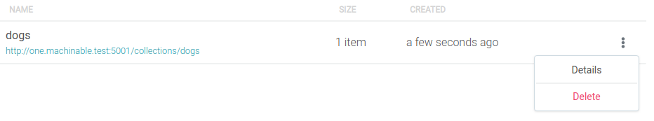
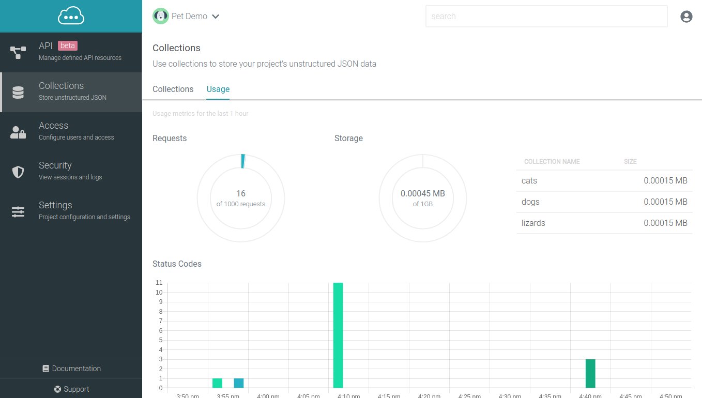

# Collections

Collections are endpoints which store any form of JSON data, with no validation. A single collection could have multiple JSON objects, all with different fields and values.

## Manage Collections

### Create a new Collection

To create a new Collection, navigate to your Project's Collections page. We will create a dogs collection in our Pet Demo project.

Collections are created when data is first created, so POST a JSON object to the collections endpoint you would like to create:

{!querying_data/queries/create.md!}

The `dogs` collection should now be listed on the Collections page.

### View Details

To view the details of an existing Collection, click the ellipsis button and select `More`.

This will open a modal with the details of the selected Collection:

**Settings**

Displays helpful information regarding the Collection including the name, ID, and URL to the Collection's data. There are also a few editable fields here for `Parallel Read` and `Parallel Write` which control user access to the data. To learn more about these options, skip ahead to [Configure Access](/documentation/projects/collections/#configure-access)

**Data**

Lists the data stored within this Collection as a paginated list that can be traversed.

### Configure Access

By default, [Project Users & API Keys](/documentation/projects/access/) with a "User" role will only have access to their data (i.e. objects that have been created by a User/API Key can only be accessed by that User/API Key). This is based on the Machinable managed `_metadata` object that is stored and returned within each object.

!!! note
    Users/API Keys with the role of "Admin" will have access to all Collection data, based on that "User/API Key" access policy.

This access can be changed on a per Collection basis by enabling the Parallel access fields:

**Parallel Read**

When enabled, any User/API Key can read (Get, List) any object, regardless of who/what created it. Disabled by default.

**Parallel Write**

When enabled, any User/API Key can write (Update, Delete) any object, regardless of who/what created it. Disabled by default.

## Querying Data

Refer to the [Querying](/documentation/querying_data/crud/) documentation to see detailed examples regarding how to query for API Resource and Collection data.

### Possible Errors

{!querying_data/errors.md!}

## Usage

Usage metrics are gathered for any requests made to Collections. You can view your project's usage metrics by navigating to `Collections > Usage`.

Usage reports the following metrics:

**Requests**

This is the count of HTTP Requests made to all of the collections endpoints in the last 1 hour.

**Storage**

Storage is distributed across 2 visualizations. The first is the **total space in MB** used by collection data. The second is a table showing the amount of space, in MB, each collection is using.

**Status Codes**

This visualizes the count of status codes of each request to Collections, summarized every 5 minutes, for the past 1 hour.

**Average Response Times**

This visualizes the response times of each request to Collections, averaged every 5 minutes, for the past 1 hour.
