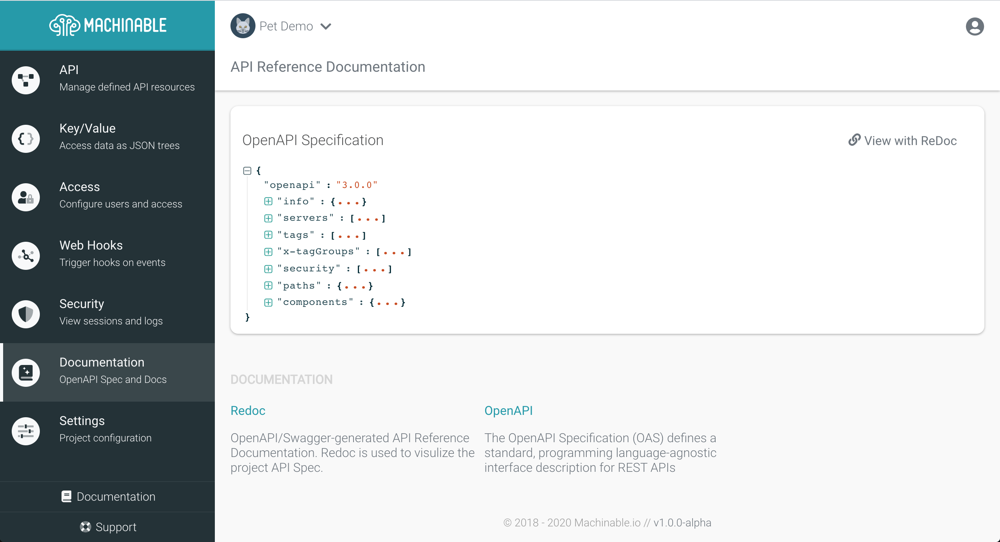
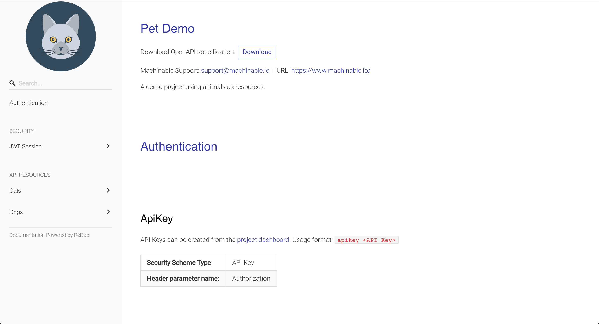
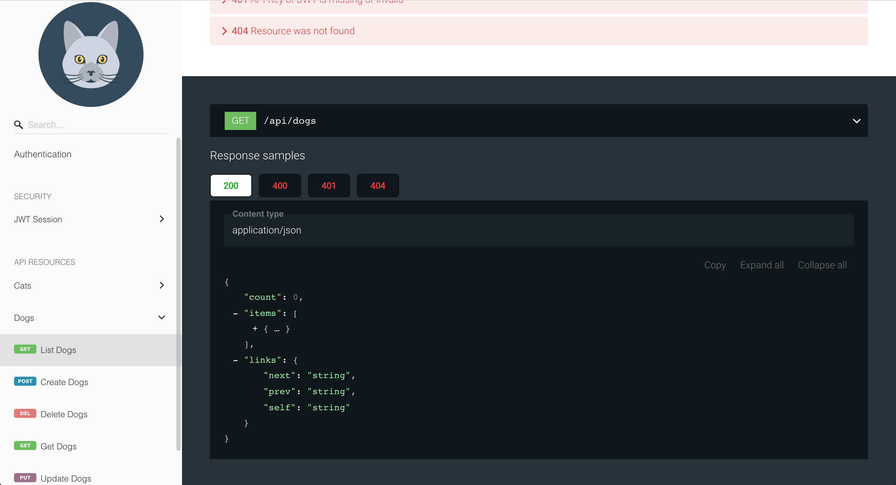

Since API Resources are already described with JSON Schema (and Key/Values are just `objects`), the OpenAPI specification is compiled and made available to you and your API users. The OpenAPI specification can then be used to write your own backend using the same HTTP Interfaces made available by Machinable or automatically generate clients and UIs. 

## OpenAPI

View and download your Project's OpenAPI Specification by navigating to `Documentation`.

From here you can copy the spec or view the spec with [Redoc](https://redocly.github.io/redoc/).

## Redoc

Machinable provides hosted documentation using [Redoc](https://redocly.github.io/redoc/). Redoc provides dynamic documentation of your Project's API using the OpenAPI specification document.

Anyone with the documentation link can view your Project's API Docs!
