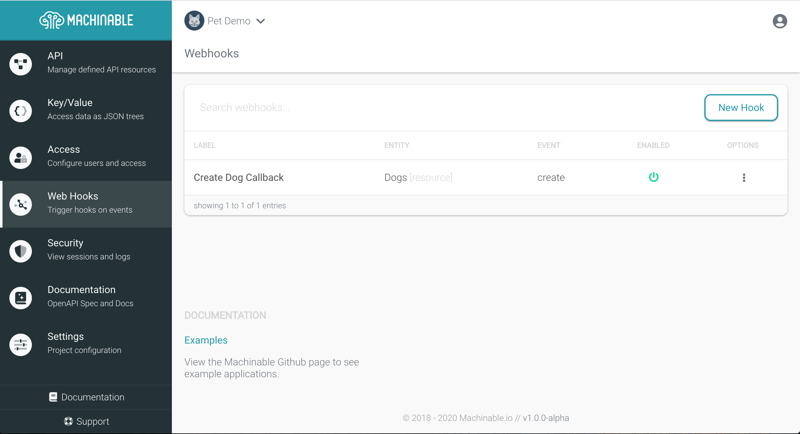
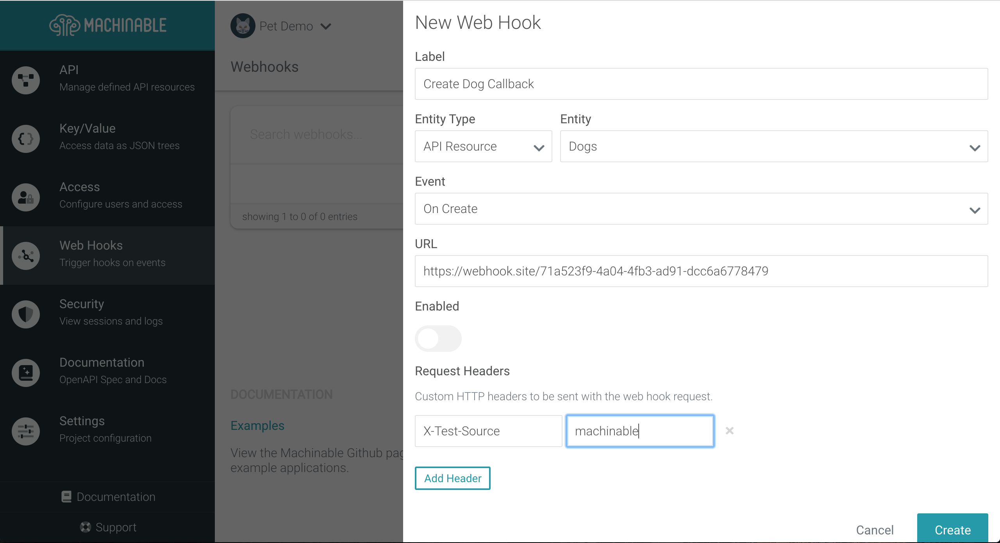
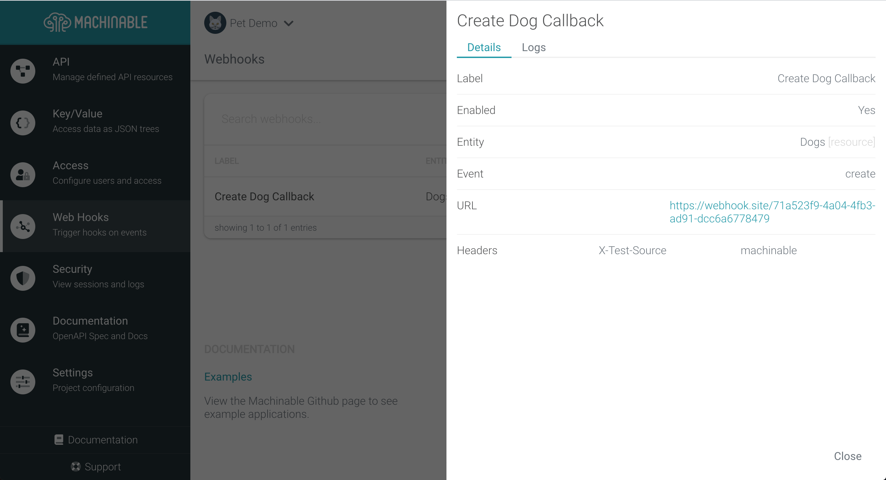
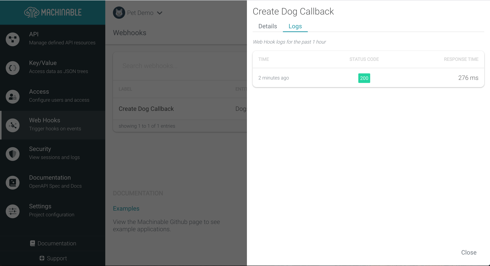

Web Hooks can be configured to send events to custom endpoints when API Resources or Root Keys are created, edited, or deleted. Use Web Hooks to callback to your server in order to implement custom business logic for your app.

## Manage Web Hooks

Navigate to your Project's `Web Hooks` page and click `New Hook` to configure a new Web Hook.

### Create/Edit Hooks





**Label**

The human readable label for the Web Hook. Use a short, but descriptive, label so it is easy to identify the purpose of this Hook.

**Entity Type**

The entity type is either an `AP Resource` or `Key/Value`.

**Entity**

Based on the Entity Type, this will contain the list of API Resources or Key/Value Root Keys.

**Event**

Which event should trigger this Web Hook? `create`, `edit`, or `delete`?

**URL**

This will be your project's valid URL to POST the Web Hook JSON payload. This can be another Machinable resource (API or Key/Value), but be aware that it will impact your project's request limit.

**Enabled**

Whether the Web Hook will trigger on the selected event or not. This can be changed at any time.

!!! note
    If the Web Hook fails when making a request to the configured URL, the Web Hook will be automatically disabled.

**Request Headers**

A map of headers to be sent along with the Web Hook HTTP POST request. Set as many custom headers as needed for your callback server.

### View Details and Logs

Once a Web Hook is configured, select it from the list to view the configured details as well as the logs relevant to each POST request.





### Payload

When a Web Hook is sent, a single request is made to the URL with a JSON payload of the following schema:

```json
{
  "type": "object",
  "properties": {
    "entity_key": {
      "type": "string",
      "description": "The path name of the API Resource or Root Key of the Key/Value."
    },
    "entity_type": {
      "type": "string",
      "description": "The Machinable type of this payload; API Resource(resource) or Key/Value(json)",
      "enum": [
        "resource",
        "json"
      ]
    },
    "event": {
      "type": "string",
      "description": "The event that trigger the Web Hook. This should match the configured event.",
      "enum": [
        "create",
        "edit",
        "delete"
      ]
    },
    "payload": {
      "type": "object",
      "description": "The payload will contain the JSON of the resource relevant to this Web Hook event."
    },
    "project_Id": {
      "type": "string",
      "format": "uuid",
      "description": "The UUID of the project"
    }
  }
}
```

See below for an example request that triggers a Web Hook using the `Dogs` [API Resource created previously](./resources.md):

```sh
curl -s -X POST -d '{"name": "Lucy", "breed": "mut", "age": 5}' -H "Authorization: apikey $API_KEY" https://pet-demo.machinable.io/api/dogs | jq "."
{
  "_metadata": {
    "creator": "186f5d7a-58bf-47cd-ae29-cf4137bd8bc9",
    "creator_type": "apikey",
    "created": 1582234699
  },
  "age": 5,
  "breed": "mut",
  "id": "b9737cfa-a69e-44e9-8f52-5bb1bed1f5ae",
  "name": "Lucy"
}
```

The request above results in the following Web Hook payload to be sent to the configured URL:

```json
{
  "entity_key": "dogs",
  "entity_type": "resource",
  "event": "create",
  "payload": {
    "_metadata": {
      "created": 1582234699,
      "creator": "186f5d7a-58bf-47cd-ae29-cf4137bd8bc9",
      "creator_type": "apikey"
    },
    "age": 5,
    "breed": "mut",
    "id": "b9737cfa-a69e-44e9-8f52-5bb1bed1f5ae",
    "name": "Lucy"
  },
  "project_Id": "02327c9f-b523-45b6-b8a1-4cd47565aeba"
}
```

## Options

### Disable With Headers

If needed, Web Hooks can be disabled for a single request by setting the `X-Trigger-Hooks` header to `false`. Using the example above, we can disabled the configured Web Hook like so:

```sh
curl -s -X POST -d '{"name": "Lucy", "breed": "mut", "age": 5}' -H "Authorization: apikey $API_KEY" -H "X-Trigger-Hooks: false" https://pet-demo.machinable.io/api/dogs
```

This would be useful if your callback server needs to update the created record with some kind of life cycle state (or whatever) and you have a Web Hook configured for `edit` events. That way you don't end up in an endless loop which exhausts your API request limit.
