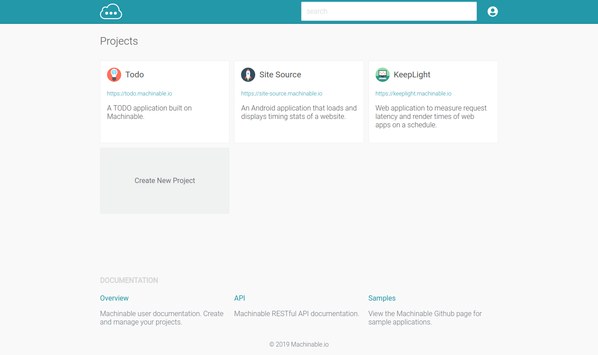

# Projects

A Machinable Project is a place to create and organize your application's API Resources, Collections of data, Users, and API Keys. Projects are created and managed by a Project Administrator. A project will have a unique hostname, `{project-slug}.machinable.io`, that will provide access to the project's resources.

## Use Cases

You can use a Machinable Project for many purposes:

* Build a prototype HTTP API quickly
* Use Collections as a Dummy HTTP API for test data
* Store valid JSON objects in an API Resource for your production application
* Provide a public API to open source data
* etc.

Take a look at our growing list of [sample projects]() to get an idea of what you can use Machinable for.

## What's Next?

1. [Create an API Resource](/documentation/projects/resources/)
2. [Create a Collection](/documentation/projects/collections/)
3. [Create a Project User or API Key](/documentation/projects/access/)
4. [Create some data](/documentation/querying_data/crud/)

 