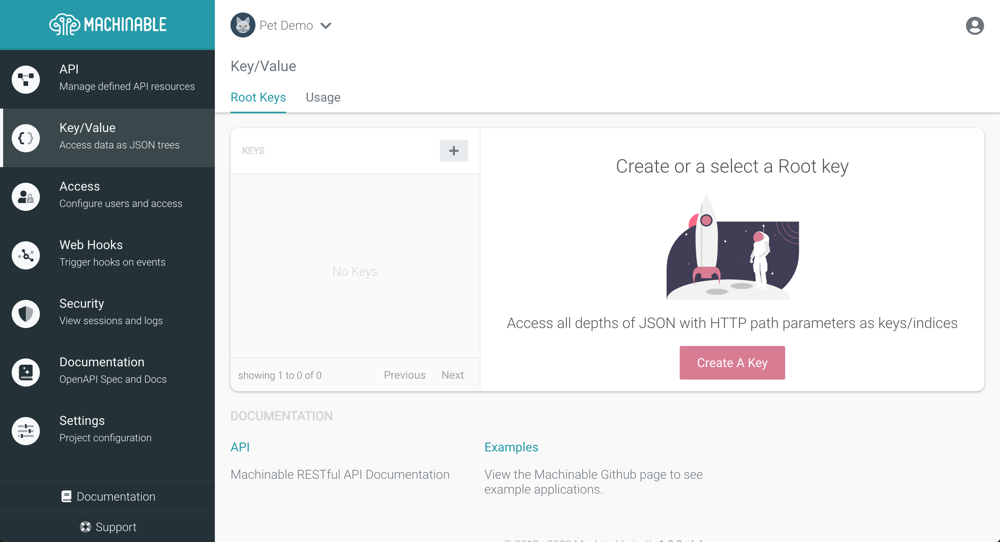
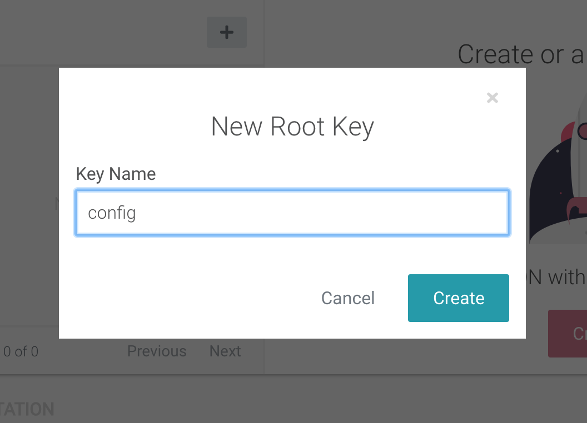
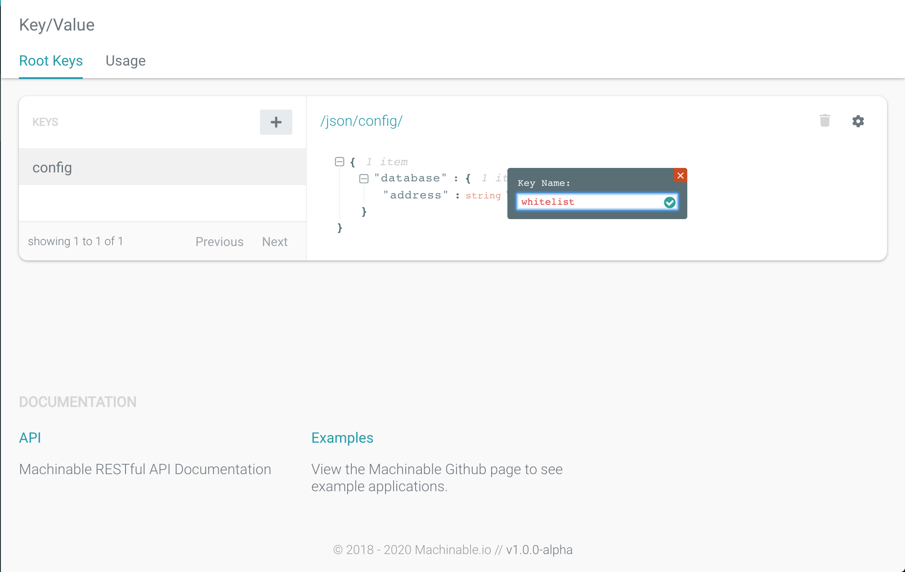
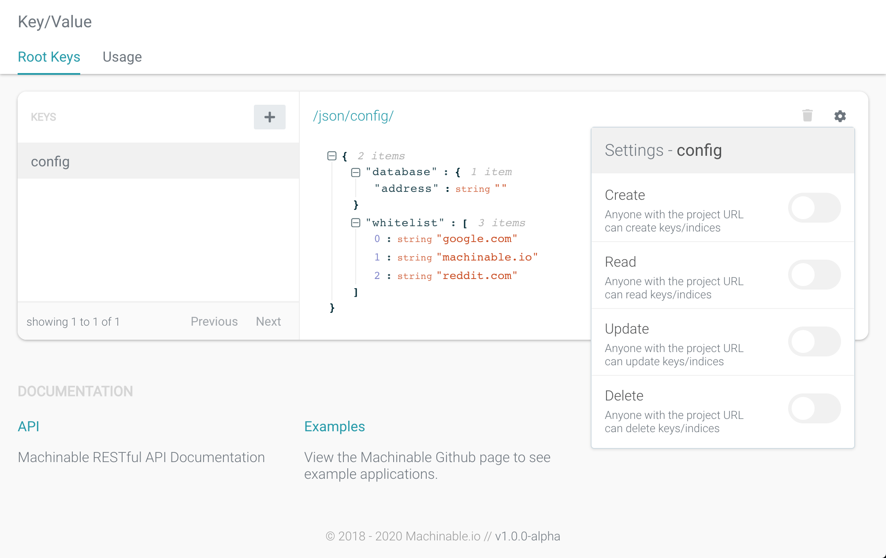
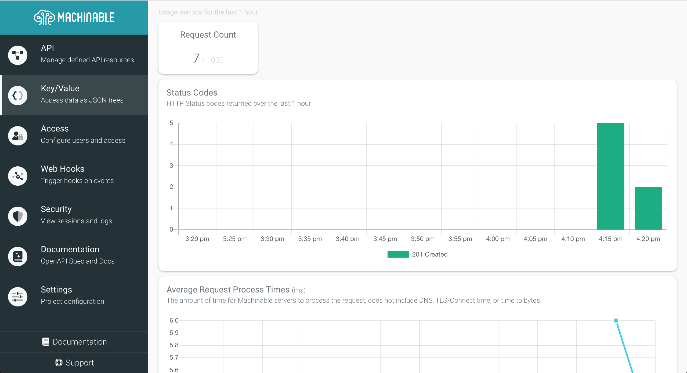

Key/Values are just JSON objects, where the full object is accessed by the Root Key. Each layer of the JSON structure can then be accessed, and edited, with HTTP path parameters as keys/indices to the JSON.

## Manage Root Keys

### Create a New Key

To get started with Machinable Key/Values, navigate to your Project's `Key/Value` page. From this page you can create, edit, and delete you project's Root Key's as well as their contents.



From this page select `Create A Key` from the empty state area. We will create a sample configuration JSON object with the Root Key of `config`.



### Retrieve/Edit JSON

Once you've created your Root Key, you can use the JSON Editor to change it's contents. See below as we add some configuration values to the JSON.



The JSON value of the root key can then be accessed via HTTP Request:

```sh
$ curl -s https://pet-demo.machinable.io/json/config/ | jq "."
{
  "database": {
    "address": ""
  },
  "whitelist": [
    "google.com",
    "machinable.io",
    "reddit.com"
  ]
}
```

Access JSON structure with HTTP path parameters as keys/indices to the JSON:

```sh
$ curl -s https://pet-demo.machinable.io/json/config/whitelist/1 | jq "."
"machinable.io"
```

Add or edit keys with `POST` and `PUT` verbs:

```sh
$ curl -s -X POST -d '"github.com"' https://pet-demo.machinable.io/json/config/whitelist/0 | jq "."
"github.com"
$ curl -s https://pet-demo.machinable.io/json/config/whitelist | jq "."
[
  "github.com",
  "google.com",
  "machinable.io",
  "reddit.com"
]
```

### Access

By default, access to Root Keys is open to anyone with the project URL. To restrict access, select the gear icon in the top right corner of the Root Key JSON window and change the access settings.



**Create**

Authentication is required to create new objects.

**Read**

Anyone with the project URL can read objects.

**Update**

Authentication is required to update objects.

**Delete**

Authentication is required to delete objects.

### Usage

Usage metrics are gathered for any requests made to Root Keys. You can view your project's usage metrics by navigating to `Key/Value > Usage`.



Usage reports the following metrics:

**Requests**

This is the count of HTTP Requests made to all of the Key/Value JSON in the last 1 hour.

**Status Codes**

This visualizes the count of status codes of each request to Key/Value JSON, summarized every 5 minutes, for the past 1 hour.

**Average Response Times**

This visualizes the response times of each request to Key/Value JSON, averaged every 5 minutes, for the past 1 hour.

### Sample Queries

!!! note
    The sample queries use [jq](https://stedolan.github.io/jq/) to process and format response JSON.

#### Create data for root key

```sh
$ curl -s -X PUT -d '{ "7f98c91d5-e7be-4828-aa42-6866d134af6c": { "age": 32, "friends": [ "Mary", "John", "Ron" ], "job": { "title": "Clerk" }, "name": "Bob" }, "a973933c-a72c-41db-96c9-1369d196052b": { "age": 57, "friends": [ "Lisa" ], "job": { "title": "Engineer" }, "name": "Sam" } }' https://misc.machinable.io/json/people/ | jq "."
{
  "7f98c91d5-e7be-4828-aa42-6866d134af6c": {
    "age": 32,
    "friends": [
      "Mary",
      "John",
      "Ron"
    ],
    "job": {
      "title": "Clerk"
    },
    "name": "Bob"
  },
  "a973933c-a72c-41db-96c9-1369d196052b": {
    "age": 57,
    "friends": [
      "Lisa"
    ],
    "job": {
      "title": "Engineer"
    },
    "name": "Sam"
  }
}
```

#### Retrieve individual keys

```sh
$ curl -s https://misc.machinable.io/json/people/7f98c91d5-e7be-4828-aa42-6866d134af6c | jq "."
{
  "age": 32,
  "friends": [
    "Mary",
    "John",
    "Ron"
  ],
  "job": {
    "title": "Clerk"
  },
  "name": "Bob"
}
```

#### Retrieve by index of array

```sh
$ curl -s https://misc.machinable.io/json/people/7f98c91d5-e7be-4828-aa42-6866d134af6c/friends/1 | jq "."
"John"
```

#### Create new key

```sh
$ curl -s -X POST -d '4' https://misc.machinable.io/json/people/7f98c91d5-e7be-4828-aa42-6866d134af6c/job/years | jq "."
4

$ curl -s https://misc.machinable.io/json/people/7f98c91d5-e7be-4828-aa42-6866d134af6c/job | jq "."
{
  "title": "Clerk",
  "years": 4
}
```

#### Update key

```sh
$ curl -s -X PUT -d '{"title": "Manager", "years": "1"}' https://misc.machinable.io/json/people/7f98c91d5-e7be-4828-aa42-6866d134af6c/job | jq "."
{
  "title": "Manager",
  "years": "1"
}
```

#### Delete key

```sh
$  curl -s -X DELETE https://misc.machinable.io/json/people/7f98c91d5-e7be-4828-aa42-6866d134af6c/job | jq "."{}

$  curl -s https://misc.machinable.io/json/people/7f98c91d5-e7be-4828-aa42-6866d134af6c | jq "."
{
  "age": 32,
  "friends": [
    "Mary",
    "John",
    "Ron"
  ],
  "name": "Bob"
}
```