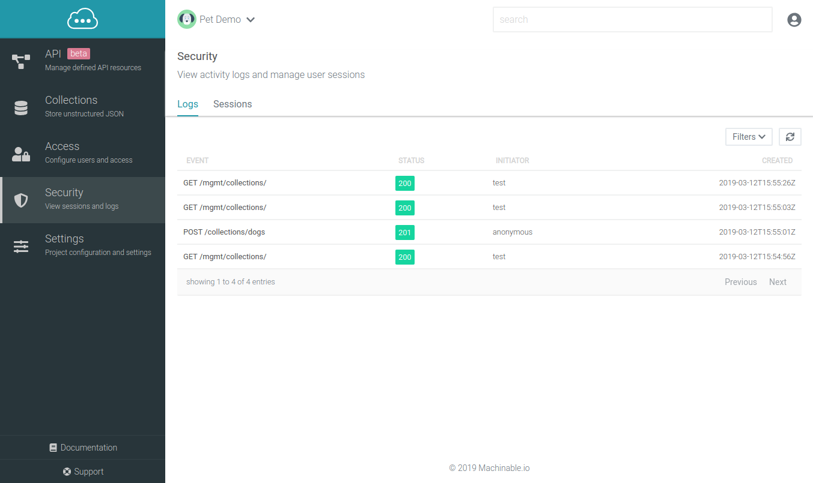
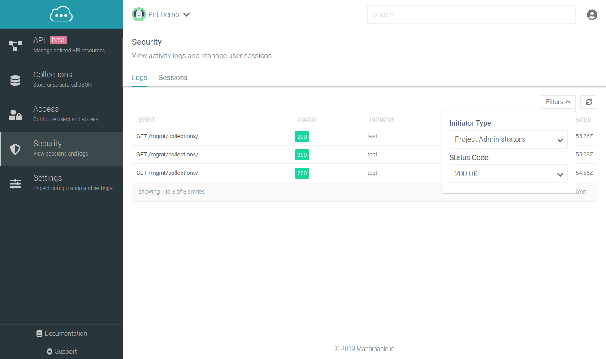
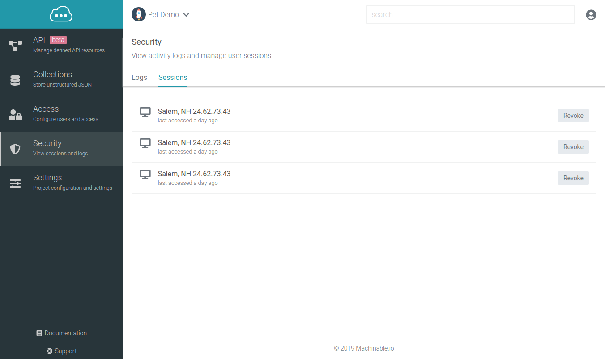

# Security

The security page provides request logs, made by project users as well as project administrators, and active project user sessions, which can be revoked if needed.

## Logs

To view request logs for your project, navigate to the project's `Security > Logs` page. This page shows all request logs for the last 24 hours. Logs include request path, response status code, initiator, and timestamp. The initiator is the name of the requester, whether it be a project user, api key description, or project administrator.

Logs can be filtered by clicking the `Filter` button at the top right of the screen. Logs are filterable by Requester Type and Status Code.

## Sessions

To view active Project User sessions, navigate to the project's `Security > Sessions` page. This page shows all active Project User sessions with helpful information including client location, IP Address, and the last time the client refreshed their access token. 

Sessions can be revoked at any time by a Project Administrator by clicking the `Revoke` button for the user. This will require the Project User to login again.

!!! note
    Revoking a session does not guarantee that a Project User will need to login again *immediately*. Their existing access token, if they have one, will allow them to make authenticated requests until that access token has expired.

 