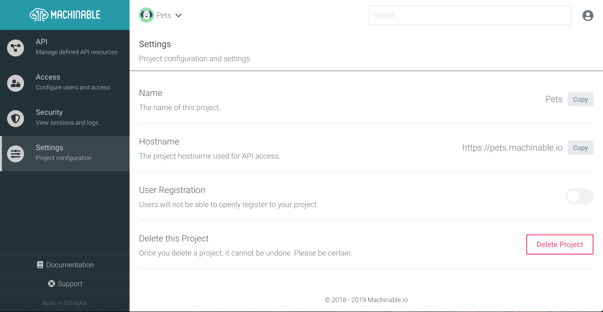

Project settings can be accessed by navigating to the `Settings` tab of the project. This page provides the Project Administrators with the Project Name and Hostnames, both of which can be copied to clipboard by clicking the `Copy` button.

The project settings page also exposes the option to enable and disable project Authentication, as well as an option to delete the project

## User Registration

This flag is a project level setting that determines whether users can openly register to your project. If it is **disabled**, users can only be created from within your project's Machinable dashboard. If it is **enabled**, anyone with the link can register a new user and begin interacting with your project's API.

## Delete Project

!!! danger
    Deleting a Project will delete all related data including API Resources, Collections and their associated data, Project Users, API Keys, Logs, and Sessions. **This is a permanent action that can not be undone**.

To delete a project:

1. Be absolutely sure that you want to delete the project, this action is permanent and can not be undone.
2. Click the `Delete Project` button.
3. Confirm you want to delete the project by selecting the `Yes, I'm Sure` button on the confirmation dialog

Your project will then be completely wiped off of the earth and you will be redirected to the project list page.

 
