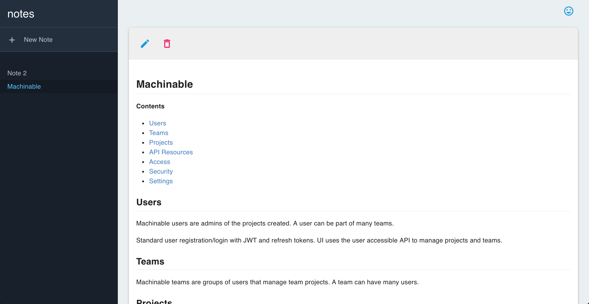

## Notes

A simple note taking application using Markdown. This application demonstrates basic user registration/login as well as API resource HTTP requests to manage notes on top of a Machinable project.

[https://www.machinable.io/notes](https://www.machinable.io/notes)

